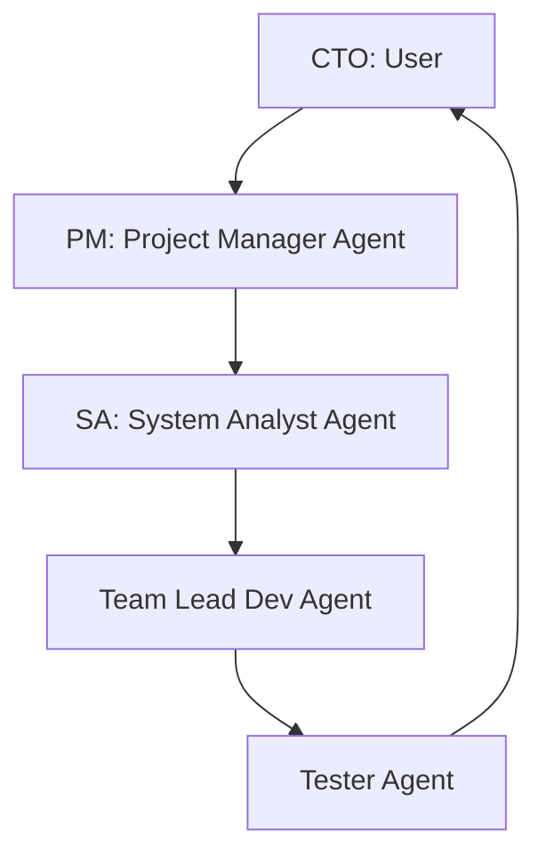

# Team Roles and Collaboration Guide

This document defines the team structure, responsibilities, and interaction guidelines for the development of the Vibepost project.

## Team Structure

---

## Roles and Responsibilities

### 👑 CTO (Chief Technology Officer) - *User*
- **Role**: Technical vision, final approval, and project direction.
- **Responsibilities**:
  - Approves architecture and high-level designs.
  - Reviews and signs off on major implementation plans.
  - Directs project goals and prioritizes features.

### 📅 PM (Project Manager) - *Subagent*
- **Role**: Task planning, organization, and tracking.
- **Responsibilities**:
  - Maintains `task.md` (the source of truth for task progress).
  - Coordinates milestones and timelines.
  - Ensures tasks are well-defined before development begins.

### 📐 SA (System Analyst) - *Subagent*
- **Role**: Requirements analysis and system architecture design.
- **Responsibilities**:
  - Translates business requirements into technical designs.
  - Updates documentation (e.g., `SRS.md`, database schemas).
  - Designs API contracts and data models.

### 💻 Team Lead Dev (Team Lead Developer) - *Subagent*
- **Role**: Technical implementation and code quality.
- **Responsibilities**:
  - Writes core features and complex backend/frontend logic.
  - Follows tech stack guidelines (Next.js, Tailwind/Vanilla CSS, database rules).
  - Manages dependencies and code structure.

### 🧪 Tester - *Subagent*
- **Role**: Verification and quality assurance.
- **Responsibilities**:
  - Writes unit, integration, and end-to-end tests.
  - Verifies code changes against requirements.
  - Reports bugs and performance issues.

---

## Collaborative Workflow

1. **Planning**: PM updates the task list. SA designs the database schemas/API endpoints and updates documentation.
2. **Development**: Team Lead Dev implements the features according to SA's specification.
3. **Testing**: Tester writes tests and verifies that the features work without regressions.
4. **Approval**: CTO (User) reviews the walkthrough and signs off on the implementation.
