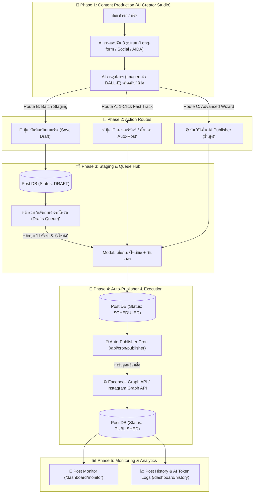

# 🚀 Vibe Post — System Features & End-to-End Workflow Architecture (Feature.md)

เอกสารสรุปความรู้ สถาปัตยกรรมการทำงาน และฟังก์ชันทั้งหมดของระบบ **Vibe Post (Content & Social Media Auto-Pilot Engine)**

---

## 📌 1. แผนภาพกระบวนการทำงานภาพรวม (End-to-End Workflow)



---

## 🌟 2. โมดูลสำคัญของระบบ (Core Features)

### 2.1 AI Creator Studio (`/dashboard/ai-studio`)
* **3-in-1 Adaptive Text Engine**: พิมพ์หัวข้อครั้งเดียว เจนเนื้อหา 3 สไตล์พร้อมกัน (บทความยาว, แคปชันกระชับพร้อมอีโมจิ, ข้อความโฆษณาโครงสร้าง AIDA)
* **AI Image Generator**: ขับเคลื่อนด้วย Google Gemini Imagen 4.0 Fast และ DALL-E พร้อมระบบสำรอง Fallback สต็อกอัตโนมัติ
* **AI Video Creator**: ระบบ Cascade คัดเลือก Luma Dream Machine, Kling AI, Google Veo 2.0 และ Pexels Curated Videos
* **Token & Cost Tracking**: คำนวณ Token และค่าใช้จ่ายจริงรายครั้งพร้อมแปลงเป็นเงินบาท (THB) แบบ Real-time

### 2.2 Instant Auto-Post & Scheduling Modal (`StudioAutoPostModal.tsx`)
* เปิดหน้าต่างพรีวิว Social Feed ทันทีจาก AI Studio โดยไม่ต้องเปลี่ยนหน้า
* สลับเลือกบัญชีเพจ Facebook, Instagram, LinkedIn, TikTok ได้อย่างอิสระ
* รองรับทั้งการสั่ง **"⚡ โพสต์ทันที (Post Now)"** และ **"📅 ตั้งเวลา Auto-Post (Schedule)"**

### 2.3 Staged Drafts Queue / Content Hub (`/dashboard/history`)
* **คลังแบบร่างรอโพสต์ (Drafts Queue)** สำหรับระบบทำงานแบบ Batch Production: ครีเอเตอร์สามารถสร้างเนื้อหาตุนไว้ 10-20 โพสต์ล่วงหน้า
* **Action Card**: แต่ละการ์ดแสดง Thumbnail รูปภาพ/วิดีโอ, ข้อความแคปชัน, วันเวลาที่สร้าง พร้อมปุ่ม:
  * **`[ 🚀 ตั้งค่า & สั่งโพสต์ ]`**: ดึงแคปชันและสื่อเปิด Modal ตั้งค่าและส่งเข้าคิว Auto-Post ได้ทันที
  * **`[ ✏️ แก้ไข ]`**: เปิดในระบบ Advanced AI Publisher
  * **`[ 🗑️ ลบแบบร่าง ]`**: ย้ายลงถังขยะแบบ Soft Delete

### 2.4 Multi-Channel AI Publisher Wizard (`/dashboard/multi-post`)
* วิซาร์ด 4 ขั้นตอน: 1. เลือกช่องทาง -> 2. ใส่ข้อความและแนบสื่อ -> 3. ตรวจสอบพรีวิว -> 4. ยืนยันเผยแพร่
* มี **Session Storage State Bridge (`vibepost_studio_preset`)** ป้องกัน URL Query Length Truncation สำหรับรูปภาพ Base64 หรือข้อความยาว

### 2.5 Cron Auto-Publisher (`/api/cron/publisher`)
* ตรวจสอบโพสต์สถานะ `SCHEDULED` ที่ถึงกำหนดเวลา
* เรียกใช้ Social Provider APIs ยิงโพสต์และอัปเดตสถานะเป็น `PUBLISHING` -> `PUBLISHED`
* หากเกิดข้อผิดพลาดจาก Token โซเชียลหมดอายุ จะบันทึกสถานะ `FAILED` พร้อม Error log ละเอียด

---

## 🗄️ 3. โครงสร้างฐานข้อมูลหลัก (Data Schema Reference)

```prisma
enum PostStatus {
  DRAFT             // แบบร่าง (อยู่ใน Drafts Queue รอตั้งค่าโพสต์)
  WAITING_APPROVAL  // รอหัวหน้าอนุมัติ
  APPROVED          // อนุมัติแล้ว
  SCHEDULED         // มีกำหนดเวลาโพสต์แล้ว (อยู่ในคิว Auto-Publisher)
  PUBLISHING        // กำลังยิงส่งข้อมูล
  PUBLISHED         // โพสต์ขึ้นโซเชียลมีเดียสำเร็จแล้ว
  FAILED            // เกิดข้อผิดพลาด
}

model Post {
  id              String         @id @default(cuid())
  workspaceId     String
  content         String
  status          PostStatus     @default(DRAFT)
  scheduledAt     DateTime?
  publishedAt     DateTime?
  media           PostMedia[]
  targets         PostTarget[]
  isDeleted       Boolean        @default(false)
  createdAt       DateTime       @default(now())
}
```

---

## 🛠️ 4. Server Actions API Summary

| Action Function | Path | คำอธิบาย |
|---|---|---|
| `createDraftPost(data)` | `@/lib/actions/posts` | บันทึกแคปชันและรูปภาพ/วิดีโอ เข้าเป็นสถานะ `DRAFT` |
| `getDraftPostsAction()` | `@/lib/actions/posts` | ดึงรายการแบบร่างทั้งหมดใน Workspace ที่ยังไม่ถูกลบ |
| `publishDraftPostAction(data)` | `@/lib/actions/posts` | อัปเดตแบบร่างให้เป็น `SCHEDULED` พร้อมผูกช่องทางและวันเวลา |
| `createScheduledPost(data)` | `@/lib/actions/posts` | สร้างโพสต์พร้อมกำหนดเวลาหรือสั่งเผยแพร่ทันที |
| `generateAIArticleAction(...)` | `@/lib/actions/ai-generation` | เรียก LLM ผลิตแคปชัน 3 รูปแบบ พร้อมบันทึก Token usage log |
| `getAIUsageStatsAction()` | `@/lib/actions/ai-generation` | ดึงสถิติยอดการใช้งาน Token และประมาณการค่าใช้จ่าย |

---

*เอกสารฉบับนี้อัปเดตอัตโนมัติตามมาตรฐานระบบ Vibe Post Core Engine*
