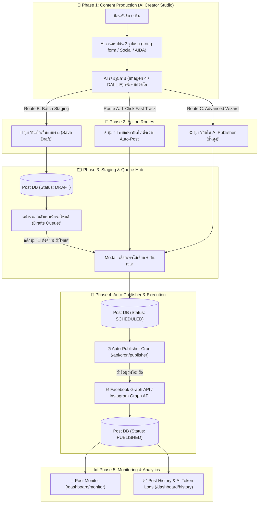

# 📘 คู่มือระบบและคู่มือการใช้งาน VibePost (System & User Manual)
### สำหรับ Project Manager (PM), System Analyst (SA) และ User Trainer

ยินดีต้อนรับสู่คู่มือการใช้งานระบบ **VibePost (Content & Social Media Auto-Pilot Engine)** เอกสารฉบับนี้จัดทำขึ้นโดยบูรณาการเนื้อหาสำหรับทั้งเชิงเทคนิค (สำหรับ PM/SA) และเชิงปฏิบัติการ (สำหรับ Trainer) เพื่อเป็นเอกสารอ้างอิงในการพัฒนา ติดตั้งระบบ และนำไปใช้เทรนนิ่งผู้ใช้งานจริง

---

## 📌 1. ภาพรวมระบบ (System Overview)

**VibePost** คือระบบผู้ช่วยสร้างสรรค์เนื้อหา (Content Production) และวางแผนเผยแพร่บนโซเชียลมีเดียอัตโนมัติแบบครบวงจร (Auto-Pilot) ขับเคลื่อนด้วยขุมพลังปัญญาประดิษฐ์ (AI Studio) โดยระบบถูกออกแบบภายใต้โครงสร้าง **Multi-Workspace Isolation** ทำให้แต่ละแบรนด์หรือบริษัทสามารถแยกบริหารจัดการข้อมูล สมาชิก ทีมงาน ช่องทางโซเชียล และคีย์ตั้งค่า AI ได้อย่างเด็ดขาดและปลอดภัย

### 🔄 แผนภาพกระบวนการทำงานแบบ End-to-End



---

## 🛠️ 2. สถาปัตยกรรมระบบสำหรับ SA (System Analyst Specifications)

ในหัวข้อนี้นักวิเคราะห์ระบบ (SA) สามารถใช้ศึกษาความเชื่อมโยงของระบบหลังบ้าน API และโมเดลการรันงานต่าง ๆ

### 2.1 โมดูล AI Studio & Cascade Fallback (สมองกลสร้างรูปภาพและวิดีโอ)
เพื่อลดอัตราความล้มเหลว (Error Rate) ในการสร้างสื่อด้วย AI ระบบจึงมีลำดับการเลือกใช้เครื่องมือ (Cascade/Fallback System) ดังนี้:

* **การสร้างรูปภาพ (AI Image Creator)**:
  1. **Gemini Imagen 3/4.0 Fast**: จะถูกเลือกใช้เป็นอันดับแรกหากตรวจพบคีย์ Gemini ในระบบ
  2. **Fail-Safe Fallbacks**: หากระบบสร้างรูปภายนอกมีปัญหา หรือขีดจำกัด IP ของ Hostinger VPS ชนลิมิต ระบบจะดึงคำสำคัญ (Tags) ของเนื้อหามาทำการดาวน์โหลดรูปภาพสต็อกที่เกี่ยวข้องและมีความสวยงามผ่าน **LoremFlickr** มาทดแทนให้ทันที
* **การสร้างวิดีโอ (AI Video Studio)**:
  1. **Google Veo (ผ่าน Gemini API Key)**: ยิงคำสั่งสร้าง Long-Running Operation (`veo-2.0-generate-video`) และทำ Polling ทุก ๆ 8 วินาที (สูงสุด 30 ครั้ง) เพื่อตรวจสอบความสำเร็จ
  2. **Luma Dream Machine**: ยิงคำสั่งสร้างแบบ Text-to-Video และ Polling สถานะจนกว่าจะ `completed`
  3. **Kling AI Video**: เข้ารหัส JWT ด้วย `AccessKey:SecretKey` และยิงไปรันเซิร์ฟเวอร์สิงคโปร์
  4. **Pexels Curated Fallback**: หากไม่มีการใส่คีย์หรือการใช้ API ทั้งหมดเกิดข้อผิดพลาด ระบบจะสลับมาดึงวิดีโอคุณภาพสูงที่เราคัดสรรไว้ใน Pexels ทันที

### 2.2 วงจรอายุของโพสต์ (Post Lifecycle Status)
สถานะของตาราง `Post` และ `PostTarget` มีลักษณะการสลับค่าดังนี้:
* `DRAFT`: คอนเทนต์ถูกสร้างไว้ในคลังแบบร่าง ยังไม่มีการกำหนดเวลา
* `WAITING_APPROVAL`: รอยืนยันจากผู้บริหารผ่านระบบ Discord/Email Webhook
* `APPROVED`: ผ่านการตรวจสอบและรอเข้าคิว
* `SCHEDULED`: แนบเพจปลายทางและเวลาเรียบร้อยแล้ว รอ Cron ดึงไปเผยแพร่
* `PUBLISHING`: Cron กำลังนำส่งข้อมูลไปยัง Graph API (เพื่อป้องกันการโพสต์ซ้ำซ้อน)
* `PUBLISHED`: โพสต์บนโซเชียลมีเดียสำเร็จเรียบร้อย
* `FAILED`: โพสต์ล้มเหลว (พร้อมแสดง Error Message จาก API)

---

## 🗄️ 3. โครงสร้างฐานข้อมูล (Prisma PostgreSQL ER-Summary)

ฐานข้อมูลทำงานอยู่บน PostgreSQL โดยใช้ Prisma ORM ในการเชื่อมต่อ ตารางที่สำคัญประกอบด้วย:

```prisma
// ตัวอย่างความสัมพันธ์ที่สำคัญ (สรุปเพื่อใช้ประกอบการเทรน)
model Workspace {
  id                String             @id @default(cuid())
  name              String
  members           WorkspaceMember[]
  socialConnections SocialConnection[]
  posts             Post[]
  promptConfigs     PromptConfig[]
}

model SocialConnection {
  id            String    @id @default(cuid())
  platform      Platform  // FACEBOOK, INSTAGRAM, TWITTER, LINKEDIN, LINE, TIKTOK, YOUTUBE
  accountId     String    // Page ID / Channel ID
  accountName   String
  accessToken   String
  refreshToken  String?
}

model Post {
  id             String      @id @default(cuid())
  content        String      // ข้อความแคปชันหลัก
  status         PostStatus  // DRAFT, WAITING_APPROVAL, APPROVED, SCHEDULED, PUBLISHED, FAILED
  scheduledTime  DateTime?   // วันเวลาที่จะโพสต์อัตโนมัติ
  errorMessage   String?     // รายละเอียดข้อผิดพลาดถ้าส่งโพสต์ไม่ผ่าน
  media          PostMedia[]
  targets        PostTarget[]
}
```

---

## 🧑‍🏫 4. คู่มือการใช้งานระบบสำหรับ Trainer (User Guide / Training Guide)

หัวข้อนี้นำไปใช้เป็นคู่มือฝึกอบรมพนักงาน หรือผู้ดูแลระบบในการปฏิบัติงานจริง

### 🚀 ขั้นตอนการเริ่มทำงาน (Quick Start Workflow)

```
[ขั้นตอนที่ 1: ตั้งค่าเชื่อมต่อ] ➔ [ขั้นตอนที่ 2: สร้างคอนเทนต์] ➔ [ขั้นตอนที่ 3: เลือกเส้นทางการโพสต์]
```

#### 🔹 ขั้นตอนที่ 1: การตั้งค่าบัญชีและสมองกล (Setup Brand & API Key)
ก่อนเริ่มต้นใช้งาน ผู้ดูแลระบบจะต้องกรอกการเชื่อมต่อช่องทางและระบุคีย์ AI:
1. ไปที่เมนู **Settings (ตั้งค่า)**
2. ดูที่ **Workspace Summary** เพื่อตรวจสอบสถานะการเชื่อมต่อบริการ AI ด้านการเขียนภาพและวิดีโอ
3. **การใส่คีย์ Kling AI**: ให้ระบุในรูปแบบ `AccessKey:SecretKey` (ใช้เครื่องหมายโคลอนคั่น เช่น `ak_xyz123:sk_abc456`)
4. ไปที่เมนู **Social (จัดการช่องทาง)** เพื่อล็อกอินและเชื่อมต่อเพจ Facebook, IG หรือช่องทางอื่น ๆ

#### 🔹 ขั้นตอนที่ 2: การสร้างสรรค์เนื้อหาใน AI Studio (`/dashboard/ai-studio`)
1. เข้าไปที่เมนู **AI Studio**
2. พิมพ์หัวข้อหรือบรีฟสั้น ๆ ที่ต้องการ เช่น *"โปรโมชั่นสินค้าใหม่รับหน้าร้อน ลดสูงสุด 50%"*
3. ระบบจะทำงานเจเนอเรตให้พร้อมกันทันที 3 รูปแบบในคลิกเดียว (3-in-1 Adaptive Text Engine):
   * **Long-form**: บทความขนาดยาว ละเอียด น่าเชื่อถือ
   * **Social**: แคปชันกระชับ น่ารัก พร้อมอีโมจิดึงดูดสายตา
   * **AIDA**: โครงสร้างแบบนักเขียนโฆษณามืออาชีพ (Attention, Interest, Desire, Action)
4. ผู้ใช้สามารถคลิกสลับแท็บเพื่อดู แก้ไขข้อมูลผ่านกล่อง Textarea ได้ตามใจชอบ
5. กดปุ่ม **"สร้างรูปภาพ/วิดีโอ"** ด้านล่าง โดยระบบจะดึงสรุปประเด็นจากบทความไปทำเป็น Prompt เริ่มต้นในการวาดภาพหรือสร้างคลิปให้โดยอัตโนมัติ

#### 🔹 ขั้นตอนที่ 3: 3 เส้นทางในการเผยแพร่ (Action Routes)
เมื่อได้ข้อความและรูปภาพ/วิดีโอที่พึงพอใจแล้ว ระบบมีทางเลือกในการจัดการคอนเทนต์ 3 รูปแบบ:

* **Route A: โพสต์ด่วนทันที (Instant Auto-Post Modal)**
  * คลิกปุ่ม **"🚀 เผยแพร่ทันที / ตั้งเวลา"**
  * ระบบจะเปิด Modal พรีวิวหน้าต่างฟีดจำลองขึ้นมา ให้เราเลือกช่องทางโซเชียลมีเดีย
  * เลือก **"โพสต์ทันที"** หรือ **"ตั้งเวลา"** จากนั้นกดยืนยัน โพสต์จะถูกนำเข้าคิวรอโพสต์ทันที

* **Route B: การเก็บตุนแบบร่าง (Save Draft for Batch Production)**
  * หากครีเอเตอร์ต้องการผลิตเนื้อหาตุนไว้ทีละหลาย ๆ โพสต์ ให้กดปุ่ม **"💾 บันทึกเป็นแบบร่าง (Save Draft)"**
  * โพสต์จะเข้าไปเก็บไว้ใน **คลังแบบร่างรอโพสต์ (Drafts Queue)** หน้า `/dashboard/history`
  * เมื่อต้องการสั่งโพสต์ ให้มาที่หน้าประวัติ แล้วคลิกปุ่ม `[ 🚀 ตั้งค่า & สั่งโพสต์ ]` เพื่อเปิดหน้าต่างเลือกวันเวลาในการโพสต์

* **Route C: ตัวจัดทำขั้นสูง (Advanced Multi-Post Wizard)**
  * คลิกปุ่ม **"เปิดใน AI Publisher (ขั้นสูง)"**
  * ระบบจะใช้กลไก Session Storage ส่งต่อค่าเนื้อหาทั้งหมดไปยังตัวกรอกข้อมูลแบบทีละสเต็ป (4-Step Wizard) เพื่อจัดแจงข้อความเฉพาะเจาะจงของแต่ละโซเชียลและใส่พารามิเตอร์เพิ่มเติม

#### 🔹 ขั้นตอนที่ 4: การติดตามสถานะโพสต์ (Post Monitor & Token Logs)
1. ไปที่เมนู **Monitor** เพื่อดูตารางปฏิทินโพสต์และคิวงานที่รอการส่งออก
2. ไปที่เมนู **History** เพื่อดูสรุปประวัติโพสต์ทั้งหมด
3. ตรวจสอบ **AI Usage Summary** ด้านบนเพื่อดูจำนวน Tokens ที่ใช้ไปทั้งหมด และสรุปการประเมินค่าใช้จ่ายหน่วย USD แปลงเป็นเงินบาทไทย (THB) แบบเรียลไทม์

---

## ⚠️ 5. คู่มือแก้ไขปัญหาเบื้องต้นสำหรับผู้ดูแลระบบ (Troubleshooting Guide)

| อาการ/ปัญหา | สาเหตุที่เป็นไปได้ | แนวทางแก้ไข |
|---|---|---|
| **สั่งสร้างรูปภาพ/วิดีโอแล้วล้มเหลว หรือหมุนโหลดค้าง** | 1. คีย์ API ที่กรอกใน Settings ผิดพลาดหรือหมดอายุ<br>2. วงเงินการใช้งานของบัญชีผู้ให้บริการ (เช่น Gemini/Luma) หมดลง | 1. ไปที่หน้ารายงาน **Settings** ตรวจสอบ Badge การใช้งานของ Workspace<br>2. ทดสอบนำคีย์ใหม่ไปเปลี่ยนในระบบและบันทึกอีกครั้ง |
| **ภาพที่ออกมาเป็นภาพสต็อกทั่วไป ไม่ใช่รูปวาด AI** | ระบบตรวจพบคิวงานล้น หรือชนขีดจำกัดลิมิต IP จึงสลับใช้ระบบสำรอง (LoremFlickr Fallback) | ไม่ต้องดำเนินการใด ๆ เป็นกลไกช่วยให้หน้าเว็บไม่พัง (UX Protection) ระบบจะสลับกลับมาสร้างด้วย AI ปกติเมื่อคิวหรือโควตารอบถัดไปว่างลง |
| **โพสต์ไม่ขึ้นโซเชียลตามเวลาที่ตั้งไว้** | 1. สัญญาณ Cron-job หลังบ้านขัดข้อง<br>2. โทเค็นการเชื่อมต่อเพจ Facebook/Instagram หมดอายุ (Token Expired) | 1. ไปตรวจสอบสถานะโพสต์ในหน้า **History** ค้นหาการ์ดที่ขึ้นสถานะสีแดง `FAILED`<br>2. ดูข้อความระบุสาเหตุข้อผิดพลาด (Error Message) ด้านล่างตัวการ์ด<br>3. หากเป็นเรื่องโทเค็น ให้ไปที่หน้า **Social** แล้วทำการ Re-authenticate หรือคลิกเชื่อมต่อใหม่อีกครั้ง |
| **เปิดหน้า Wizard สัญญาณภาพหลุดหาย หรือข้อความมาไม่ครบ** | ปัญหาขนาด URL query ยาวเกินขีดจำกัดเบราว์เซอร์ในการส่งต่อหน้าข้ามระบบแบบเดิม | ระบบแก้ไขโดยส่งต่อด้วย Session Storage Bridge แทนแล้ว หากพบปัญหา ให้รีเฟรชหน้าเบราว์เซอร์หรือตรวจสอบว่าไม่ได้เปิดโหมดส่วนตัว (Incognito) ที่ปิดการทำงานของ Storage |

---
*จัดทำเอกสารโดย ทีมพัฒนาและสนับสนุนการวางแผนระบบ VibePost Core Engine*
